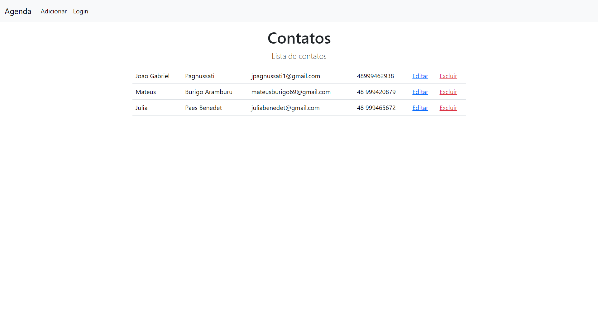
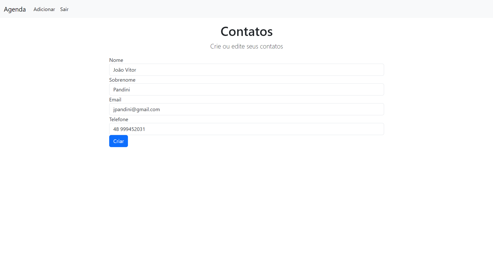
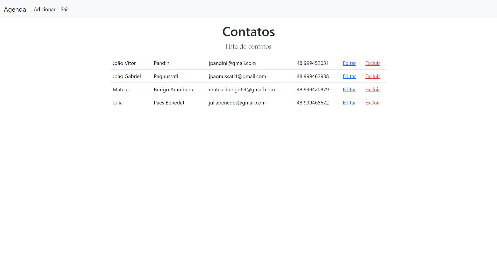

# Agenda de Contatos 📒

O projeto consiste em uma agenda telefônica, contendo informações importantes da pessoa como o número de telefone, email, nome e sobrenome da pessoa. O projeto foi desenvolvido com a intenção de aprender os fundamentos do CRUD (Create, Read, Update e Delete).

## Tecnologias 🧰

 
 
 
 

## Variáveis de Ambiente ⚙

Para rodar esse projeto, você vai precisar adicionar as seguintes variáveis de ambiente no seu .env:

`PORT = <porta de sua preferência>` 

`CONNECTIONSTRING = <sua string de conexão do mongodb>`

## Rodando localmente 👨‍💻

Clone o projeto:

```bash
  git clone https://github.com/Pagnussati/projeto-agenda.git
```

Entre no diretório do projeto:

```bash
  cd projeto-agenda
```

Instale as dependências:

```bash
  npm install
```

Inicie o servidor:

```bash
  npm start
```

## Pré-Visualização 📷




